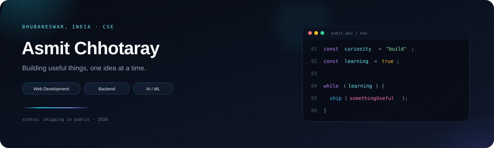

<!--
  GitHub profile README for Asmit-06
  Upload this file + the assets/ folder to github.com/Asmit-06/Asmit-06
-->

<div align="center">
  
</div>

<br />

<div align="center">
  <a href="https://github.com/Asmit-06">
    
  </a>
</div>

<div align="center">
  
  <a href="https://github.com/Asmit-06?tab=repositories">
    
  </a>
  
</div>

<br />

<div align="center">
  <a href="https://my-portfolio-wheat-xi-28.vercel.app" target="_blank">
    
  </a>
  <a href="https://www.linkedin.com/in/asmit-chhotaray-375003373/" target="_blank">
    
  </a>
  <a href="mailto:asmitchhotaray@gmail.com">
    
  </a>
  <a href="https://github.com/Asmit-06" target="_blank">
    
  </a>
</div>

---

## About me

B.Tech **Computer Science** student in **Bhubaneswar**, building for the web and slowly getting dangerous with AI/ML. I like taking a messy idea, breaking it into smaller problems, and shipping something people can actually use.

```js
const curiosity = "build";
const learning  = true;

while (learning) {
  ship(somethingUseful);
}
```

- **Now building:** [SystemVault](https://github.com/Asmit-06/SystemVault) — a file vault with upload, download, and delete
- **Learning:** React, backend development, machine learning fundamentals, Three.js, advanced DSA
- **Open to:** collaboration on web apps, AI/ML, and beginner-friendly open source
- **Ask me about:** Java, DSA, React, Node.js, MongoDB, and the basics of AI/ML
- **Fun fact:** I `console.log` more than I talk to people

<p align="left">
  
  
  
</p>

---

## Featured work

A few projects that show what I am learning, testing, and shipping.

<table>
  <tr>
    <td width="50%" valign="top">
      <h3><a href="https://github.com/Asmit-06/SystemVault">SystemVault</a></h3>
      <p>Work-in-progress secure file vault. Upload, download, and delete files through a full-stack app I am actively building.</p>
      <p>
        
        
        
      </p>
    </td>
    <td width="50%" valign="top">
      <h3><a href="https://github.com/Asmit-06/Expense-Tracker">Expense Tracker</a></h3>
      <p>MERN finance app with JWT auth, password reset, dashboards, charts, and full CRUD for income and expenses.</p>
      <p>
        
        
        
        
      </p>
    </td>
  </tr>
  <tr>
    <td width="50%" valign="top">
      <h3><a href="https://github.com/Asmit-06/3D-Can-Scroll">3D Can Scroll</a></h3>
      <p>Scroll-driven 3D soda-can experience built with React Three Fiber, Three.js, GSAP, and Tailwind.</p>
      <p>
        
        
        
      </p>
    </td>
    <td width="50%" valign="top">
      <h3><a href="https://github.com/Asmit-06/Two-Good-Co-Website">Two Good Co</a></h3>
      <p>Responsive branded landing page used to practice motion design, GSAP scroll effects, and a clean Tailwind workflow.</p>
      <p>
        <a href="https://two-good-co-website-508yv65si-asmitchhotaray-6883s-projects.vercel.app/"></a>
        
        
      </p>
    </td>
  </tr>
</table>

<p align="center">
  <a href="https://github.com/Asmit-06/SystemVault">
    
  </a>
  <a href="https://github.com/Asmit-06/Expense-Tracker">
    
  </a>
</p>

<p align="center">
  <a href="https://github.com/Asmit-06/3D-Can-Scroll">
    
  </a>
  <a href="https://github.com/Asmit-06/my-portfolio">
    
  </a>
</p>

<p align="center">
  <a href="https://my-portfolio-wheat-xi-28.vercel.app">
    
  </a>
</p>

<details>
<summary><strong>More experiments</strong></summary>
<br />

- [Apple 3D Clone](https://github.com/Asmit-06/Apple-3D-Clone) — product-page motion and 3D practice
- [3D Earth](https://github.com/Asmit-06/3D-Earth) — Three.js globe study
- [Gemini Bot](https://github.com/Asmit-06/Gemini-Bot) — conversational UI around Gemini
- [Notes App](https://github.com/Asmit-06/Notes-app) — quick CRUD notes client
- [Iris classification](https://github.com/Asmit-06/iris-flower-classification) · [Recommendation system](https://github.com/Asmit-06/recommendation-system) · [Rule-based chatbot](https://github.com/Asmit-06/python-rule-based-chatbot)

</details>

---

## Languages and tools

<div align="center">
  
</div>

<br />

| Layer | Stack |
| :--- | :--- |
| **Languages** | Java · JavaScript · Python · HTML · CSS · SQL |
| **Frontend** | React · Tailwind CSS · Three.js · GSAP |
| **Backend** | Node.js · Express · REST APIs · JWT |
| **Databases** | MongoDB · MySQL |
| **Data / ML** | Pandas · Seaborn · scikit-learn basics |
| **Tools** | Git · GitHub · Postman · VS Code · Blender |

<p align="center">
  
  
  
  
  
  
  
  
</p>

---

## GitHub stats

<div align="center">
  
  
</div>

<br />

<div align="center">
  
</div>

---

## Let's build something

Interested in a project, a learning opportunity, or just a conversation about tech? My inbox is open.

<div align="center">
  <a href="mailto:asmitchhotaray@gmail.com">
    
  </a>
  <a href="https://www.linkedin.com/in/asmit-chhotaray-375003373/">
    
  </a>
  <a href="https://my-portfolio-wheat-xi-28.vercel.app">
    
  </a>
</div>

<br />

<p align="center">
  <i>Building useful things, one idea at a time.</i>
</p>

<p align="center">
  
</p>
